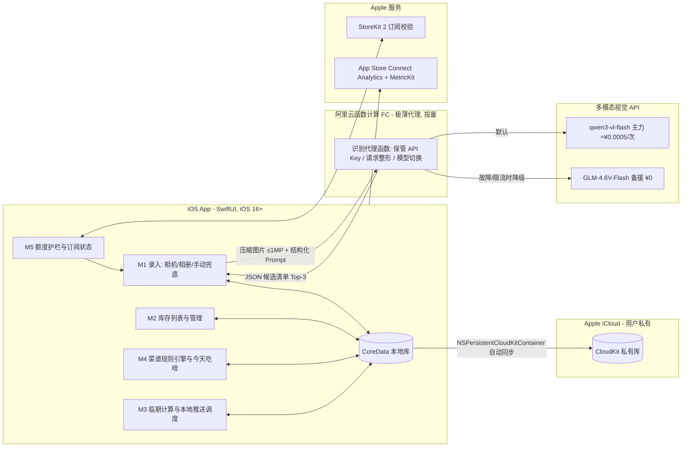

# 冰箱食材管家 技术栈报告

| 版本 | 日期 | 状态 | 作者 |
|---|---|---|---|
| v0.1 | 2026-08-17 | 已确认(2026-08-17 门禁) | 架构师 |

## 📌 文档头契约(下游先读这节)
- **关键结论**(≤5 条):
  1. **推荐方案 A**:SwiftUI 原生(iOS 16+)+ CoreData/NSPersistentCloudKitContainer(iCloud 私有库同步,零后端数据)+ **极薄 Serverless 代理**(阿里云函数计算 FC 单函数,仅保管识别 API Key)+ 云端多模态视觉 API + 本地规则菜谱引擎 + StoreKit 2。加权总分 **4.70/5**(B 4.05、C 3.65)。
  2. **识别 API 推荐**:主力 `qwen3-vl-flash`(阿里云百炼,输入 ¥0.15/输出 ¥1.5 每百万 token,≤32K 档)→ 单次识别 **≈¥0.0005**;备援 `GLM-4.6V-Flash`(智谱,**完全免费**,无 SLA/限并发,仅故障降级用)。OpenAI 兼容接口,切换成本低。
  3. **菜谱推荐首发用本地规则引擎**(非 LLM):FR-08 验收标准本身是规则口径,确定性、离线、零边际成本;LLM 生成菜谱留二期订阅卖点。
  4. **月度第三方成本量级**(12 次/用户/月):1 万 MAU ≈ ¥135/月;10 万 ≈ ¥829/月;50 万 ≈ ¥3,907/月(计算式见 third-party-services.md);总成本占订阅毛收入 1.9–3.3%,可行性报告「成本收不抵支」风险解除。
  5. **A-017/A-018 校验**:A-018 免费额度 N 可行区间 **[15, 60] 次/月,推荐 N=30**(订阅档 M=300);A-017 Top-3≥85% 口径技术上可达(中置信),数值须开发首周基准测试实测,方案已给出(见 third-party-services.md 第 6 节)。
- **关键假设与置信度**:A-019~A-024(见 third-party-services.md 第 8 节);最高风险 = 整拍多食材识别准确率(A-017)与 Serverless 冷启动(均有缓解)。
- **可引用承诺**:技术栈清单、架构图、打分表、风险条目可被 AI 开发计划/报价引用;阶段 4 回填校准以本文件定稿(用户确认后)为准;识别 API 对接工时影响提示见第 4.3 节。
- **未决问题**:见 `docs/04-tech/questions-stage4.md`(共 7 题)。

## 1. 选型约束
> 来源:项目画像 + PRD v0.1 + D-001/D-003/D-005/D-015/D-017 + A-012~A-018 + feature-list.md。

| 约束 | 内容 | 来源 |
|---|---|---|
| 团队技能 | AI 辅助开发为主(功能清单 87% 子任务适合 AI 并行),人只主导 3 项联调;需语料充分的成熟生态 | feature-list 契约第 4 条 |
| 目标平台 | iOS 16+,iPhone 全尺寸,iPad 兼容显示;单语言简中 | D-001、D-017、非功能 |
| 架构红线 | **无自建后端**(A-015,高)、无账号体系(D-015)、数据本地 + iCloud 备份(D-015) | decisions.md |
| 性能 | 识别 API 往返 P95 ≤3s;录入全链路 ≤10s(#8 红线);冷启动 ≤2s;无网提醒可用 | PRD 非功能 |
| 商业 | 免费版闭环完整 + 订阅解锁额度(D-003,¥12/月);识别成本必须可被免费额度政策控制 | D-003/D-005、可行性结论 |
| 预算 | SOM 中值 ¥272 万/年(D-008)→ 基础设施月成本须在千元级以下(50 万 MAU 之前) | feasibility.md |
| 上线时间 | MVP 直接工时 34.5 人日(初估),选型不得显著放大 | feature-list.md |

**架构矛盾裁决(关键)**:A-015「无自建后端」与「付费 API 客户端直连」冲突——API Key 内置客户端必被提取滥用。裁决:引入**极薄 Serverless 代理**(单函数、无状态、无数据库、按量计费零闲置费),其运维性质是"托管函数"而非"自建后端",与 A-015 实质(无自有服务器/无数据库/无账号体系)兼容。此裁决记入 questions-stage4.md Q1 由用户确认。

## 2. 候选方案
### 2.1 方案总表

| 方案 | 前端 | 后端 | 数据库 | 部署 | AI 能力接入 |
|---|---|---|---|---|---|
| **A. 原生 + 极薄代理(推荐)** | SwiftUI + Swift Concurrency + PhotosPicker/AVFoundation | 无业务后端;仅阿里云 FC 单函数(API Key 代理 + 请求整形) | CoreData + NSPersistentCloudKitContainer(iCloud 私有库自动同步) | App Store + FC 按量 | 云端多模态 VL API:主力 qwen3-vl-flash(付费,¥0.0005/次)+ 备援 GLM-4.6V-Flash(免费);菜谱推荐 = 本地规则引擎,不用 LLM |
| B. 原生 + 纯端直连 | 同 A | 完全无服务端 | 同 A | App Store | 客户端混淆内置 Key 直连免费模型 GLM-4.6V-Flash(¥0);菜谱同 A |
| C. Flutter 跨端 + 轻后端 | Flutter(iOS 优先,为二期 Android 复用) | Node.js 轻后端(代理 + 未来账号/云同步预留) | 自建 PostgreSQL / Supabase | App Store + 云服务器 | 同 A 的 VL API;预留服务端编排(菜谱 LLM 化) |

### 2.2 关键决策点专项分析

#### 决策点 1:视觉识别 API 选型(国内主流多模态大模型对比)
> 价格检索日期 **2026-08-17**,来源见 third-party-services.md 第 9 节;单次成本按 850 token/次口径(A-019:图片压缩至 ~1024×1024 → 视觉 token ≈ 1024×1024÷(28×28×4) ≈ 334,加提示词 ~200、输出 JSON ~300)。

| 供应商/模型 | 输入/输出价(元/百万 token) | 单次识别成本(计算式) | 免费额度 | 计费友好度/备注 |
|---|---|---|---|---|
| **阿里云百炼 qwen3-vl-flash** ✅主力 | 0.15 / 1.5(≤32K 档) | 0.000534×0.15 + 0.0003×1.5 ≈ **¥0.0005** | 新用户每模型 100 万 token(90 天,北京区)≈1,176 次一次性 | 纯按量后付费;OpenAI 兼容;生态最成熟 |
| 阿里云百炼 qwen-vl-plus | 0.8 / 2.0 | 0.000534×0.8+0.0003×2 ≈ ¥0.0010 | 同上 | 质量高一档,成本 ×2;可作付费用户升级位 |
| 阿里云百炼 qwen-vl-max | 1.6 / 4.0 | ≈ ¥0.0021 | 同上 | 最强质量,成本 ×4;仅基准测试用 |
| 智谱 GLM-4.6V | 1.0 / 3.0 | ≈ ¥0.0015 | GLM-4.5V-Flash / **GLM-4.6V-Flash 完全免费** | 免费档无 SLA、限并发;作降级备援 |
| 百度千帆 ERNIE-4.5-Turbo-VL | 0.8 / 3.2 | ≈ ¥0.0014 | 平台试用额度 | 价格无优势,不选主力 |
| 火山方舟 doubao-seed-1.6-vision | 官方以 TPM 时长预付费为主(1.92 元/10K TPM/小时);按量口径仅第三方参考(图像输入 ~1.8 元/M) | ≈ ¥0.0034(低置信) | 每模型 50 万 token 试用 | 计费口径对低量突发 App 不友好,不选 |

**结论**:主力 `qwen3-vl-flash`(成本最低且按量透明)+ 备援 `GLM-4.6V-Flash`(免费兜底)。两家均 OpenAI 兼容,FC 代理内一行 base_url 切换。**成本影响**:单次 ¥0.0005 → 免费额度 N 的可行区间由成本覆盖率而非免费额度决定(推导见 third-party-services.md 第 4 节)。

#### 决策点 2:菜谱推荐实现方式(规则 vs LLM)
| 维度 | 规则引擎(本地) ✅首发 | LLM 生成(云端) |
|---|---|---|
| 验收对齐 | FR-08 验收标准即规则口径(现存可做判定 + 消化临期项数加权排序),可直接单测 | 无法确定性验收,需人工抽检 |
| 成本 | ¥0(纯本地计算) | 每次推荐 ~¥0.001–0.003(同 VL 价位),高频调用放大 10–50 倍月成本 |
| 离线/延迟 | 离线可用、毫秒级 | 需网络、秒级 |
| 内容质量 | 受限于 120 谱结构化质量(D-014 已定规模) | 可无限生成,但有食材安全/幻觉风险(用量错误) |
| 与订阅关系 | 高级菜谱标签解锁(P1) | 二期可作订阅卖点「AI 生成菜谱」 |

**结论**:首发规则引擎;LLM 菜谱生成列入二期 backlog(不进本期范围)。

#### 决策点 3:无后端架构下的数据同步
- **NSPersistentCloudKitContainer**(方案 A/B 采用):CoreData + iCloud 私有数据库自动同步。开发者侧 **¥0、零运维、零 PIPL 合规负担**(数据存用户自己的 iCloud,不经我方服务器);同 Apple ID 设备自动一致;局限:无跨生态(Android/Web)、冲突解决策略有限、用户关闭 iCloud 时仅本地。与 D-015「无账号 + 本地 + iCloud」完全对齐。
- 为什么不用:自建同步服务(违背 A-015,D-015 明确省 6–10 人日);Realm/MongoDB Atlas(引入账号/服务端,同理排除)。

## 3. 打分对比(0–5 分)
| 维度(权重) | 方案 A | 方案 B | 方案 C |
|---|---|---|---|
| 开发效率(20%) | 5(SwiftUI+系统框架,AI 语料最足) | 5(比 A 更少一层) | 3(Flutter 渠道联调 + 后端额外搭建,工时 +30%) |
| 生态成熟度(20%) | 5(苹果官方栈 + 百炼文档完善) | 4(依赖免费模型的非正式定位) | 4(Flutter 成熟,但国内 iOS 原生生态更深) |
| 招聘/AI 语料充分度(15%) | 5(SwiftUI 语料极充分) | 4(同 A 但无代理层参考样例) | 4(Dart/Flutter 语料充分但略少于 Swift) |
| 运行成本(15%) | 4(≈¥0.00064/次全变动成本) | 5(识别 ¥0,仅 FC 无——全免) | 3(云服务器固定月费 ¥100–300 起) |
| 可扩展性(15%) | 4(换模型/加额度策略仅改代理函数) | 2(Key 内置不可换付费模型、不可控滥用) | 5(后端在手,任意扩展) |
| 与 AI 开发契合度(15%) | 5(边界清晰:端侧纯 UI/数据,代理函数单一职责) | 4 | 3(跨端 + 后端两套上下文,拆解面变大) |
| **加权总分** | **4.70** = 5×.2+5×.2+5×.15+4×.15+4×.15+5×.15 | **4.05** | **3.65** |

> 权重说明:沿用模板默认权重;本项目「运行成本」实为盈利关键(可行性风险 2),但方案 A 在该维度仅失 1 分且换来可扩展性 +2,综合不受影响——已在推荐理由中显式说明。

## 4. 推荐结论
- **推荐:方案 A(SwiftUI 原生 + 极薄 FC 代理 + qwen3-vl-flash 主力/GLM-4.6V-Flash 备援 + 本地规则菜谱引擎 + CloudKit 同步)**
- 理由:① 唯一同时满足 D-001/D-015/A-015 三条已确认决策且不留安全债的方案;② 全变动成本结构(月固定仅 ¥57),与「免费为主 + 轻订阅」商业模式(D-003)最匹配;③ 对 AI 开发最友好——端侧无任何自建服务,23 个子任务的拆解边界不变。
- **为什么不选 B**:客户端内置 Key 是真实安全漏洞(即使免费模型也可被脚本刷爆厂商配额并连带封号),且免费模型无 SLA,生产不可运营;省下的 ¥17–845/月代理费远小于一次安全事故代价。
- **为什么不选 C**:D-001 已确认仅 iOS,跨端红利本期无法兑现,却先付 +30% 工时与固定服务器月费;若二期做 Android,届时以「UI 层复用」评估迁移,数据层(iCloud)本就不可跨生态复用。

### 4.1 定稿技术栈清单(供回填与 AI 开发计划引用)
| 层 | 选型 | 版本/说明 |
|---|---|---|
| UI | SwiftUI + NavigationStack | iOS 16+(D-017),MV 模式,不引入第三方 UI 库 |
| 异步 | Swift Concurrency(async/await、Task) | 系统 API |
| 相机/相册 | AVFoundation + PHPickerViewController | 系统框架 |
| 持久化 | CoreData + NSPersistentCloudKitContainer | iCloud 私有库;用户可关(设置项 6.3) |
| 推送 | UNUserNotificationCenter(本地) | 3 天/1 天/当天三档(FR-07) |
| 识别通道 | HTTPS → 阿里云 FC(Node.js 18 单函数,~100 行)→ 百炼 OpenAI 兼容接口 | 客户端不持 Key |
| 序列化 | Codable(JSON 结构化输出,Prompt 约束) | — |
| 订阅 | StoreKit 2(自动续期订阅) | 小型企业计划抽成 15%(A-023) |
| 统计/崩溃 | App Store Connect Analytics + MetricKit | ¥0,零第三方合规面 |
| 包管理 | Swift Package Manager | — |

### 4.2 架构图对 P0 覆盖说明
M1 录入(FR-01~04)/M2 库存(05~06)/M3 提醒(07)/M4 菜谱闭环(08~09)/M5 护栏(10)/M6 数据层 全部在图内;P1(订阅/速览/Onboarding)、P2(筛选器)走同一架构无新增组件。

### 4.3 对阶段 3 工时回填的影响提示(交全栈工程师,本报告不回填)
- 新增子任务「FC 识别代理函数开发与部署」建议 **1~1.5 人日**(含 Key 管理、超时/重试、结构化输出校验);
- 子任务 1.2(识别 API 对接)预计维持 1.5 人日(OpenAI 兼容 SDK 成熟);
- 子任务 6.1(数据层)NSPersistentCloudKitContainer 与初估口径一致,无需上调。

## 5. 系统架构图(mermaid)

## 6. 技术风险
| 风险 | 影响 | 缓解方案 | 备选方案 |
|---|---|---|---|
| R1 整拍多食材识别 Top-3 <85%(A-017) | 核心价值(#8 十秒录入)不成立,MVP 失败判据 D-009 | ①开发首周 50 张自建评测集基准测试(方案见 third-party-services.md §6);②结构化 Prompt + Top-3 候选确认页(人在环);③客户端构图引导(单层摆放) | 升级 qwen-vl-plus/max(成本 ×2~4 仍可控);最坏缩口径为「单品清晰场景 ≥85%」并同步 D-009 |
| R2 GLM-4.6V-Flash 无 SLA/限并发 | 备援通道在高峰不可用 | 仅作降级路径,不承诺可用性;FC 内置健康探测自动切换 | 增加 ERNIE-4.5-Turbo-VL 为第三备援(¥0.0014/次) |
| R3 qwen3-vl-flash 阶梯价调整或模型下线 | 单次成本漂移,N 值失准 | 价格监控(季度复核)+ N 值做成远端可配置;OpenAI 兼容层使切换 = 改 base_url | 切 GLM-4.6V 或 ERNIE;极端情况全量切免费 flash 牺牲质量 |
| R4 用户关闭 iCloud / CloudKit 冲突 | 数据仅单设备,体验降级 | 本地库始终为主源,iCloud 为增量同步;设置页明示开关状态(D-015 既定) | 二期账号体系(PRD 已列二期) |
| R5 FC 冷启动拖慢 P95 3s 指标 | 录入全链路 10s 红线被击穿 | 函数内存 ≥512MB + 预留 1 常驻实例(月成本 ≈¥10–30);客户端图片并行压缩 | 迁移腾讯云 SCF/其他托管函数(接口不变) |
| R6 弱网/无网场景 | 识别不可用 | FR-04 手动录入无损降级(PRD 既定);失败请求不消耗额度 | — |
| R7 厂商锁定 | 迁移成本 | 全部走 OpenAI 兼容协议;Prompt 与评测集资产化(可迁移) | — |
| R8 App Store 审核风险(AI 功能+订阅) | 上线延期 | 隐私政策明示照片上传(PIPL,PRD 已列);识别失败不得阻断核心闭环 | — |

## 7. 待决策问题
见 `docs/04-tech/questions-stage4.md`(7 题:技术方案择一、识别 API 策略、N 值定档、菜谱实现、统计方案、付费用户模型、A-017 基准测试时点)。

## 8. 质量自检(skill 自检清单)
- [x] ≥2 套候选方案(3 套),打分表权重明确(沿用模板权重并说明)
- [x] 推荐结论含「为什么不选其他」(第 4 节)
- [x] 架构图覆盖全部 P0 模块(M1–M6,第 5 节 + 4.2 节映射)
- [x] 每条技术风险有缓解与备选(第 6 节,8 条)
- [x] AI 功能已说明调用方式(API 非自部署)及成本影响(决策点 1,单次 ¥0.0005)
