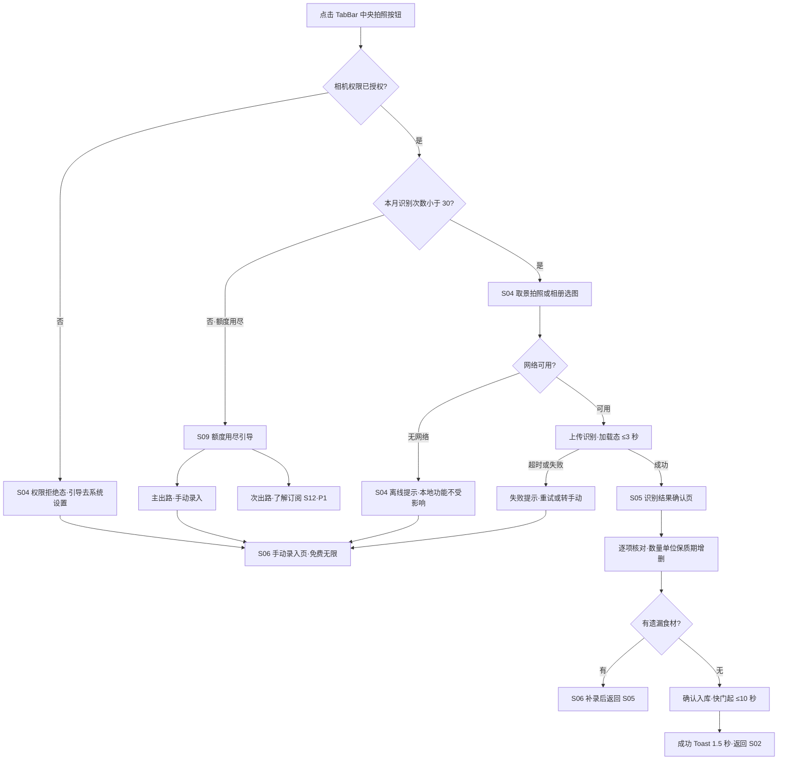
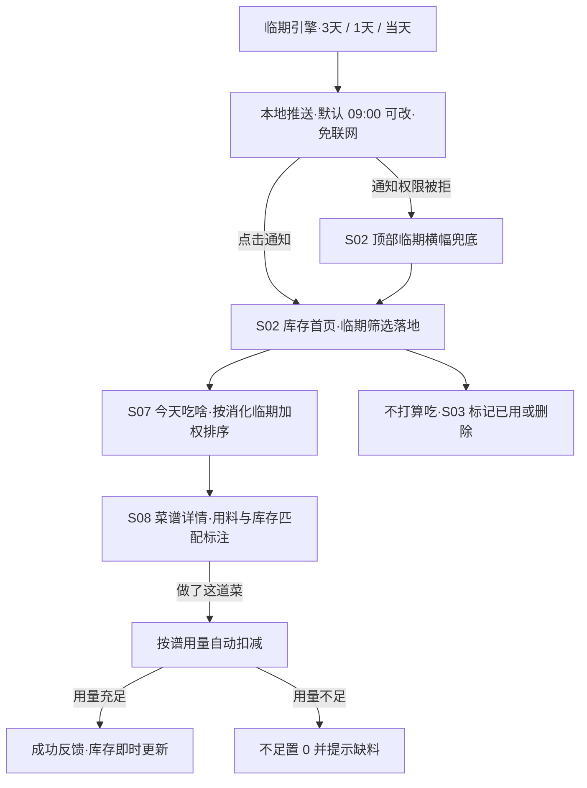
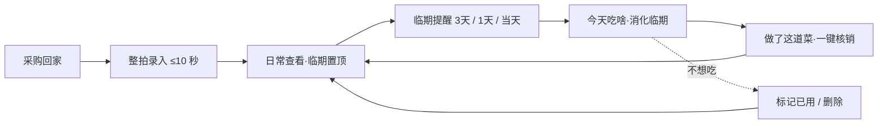
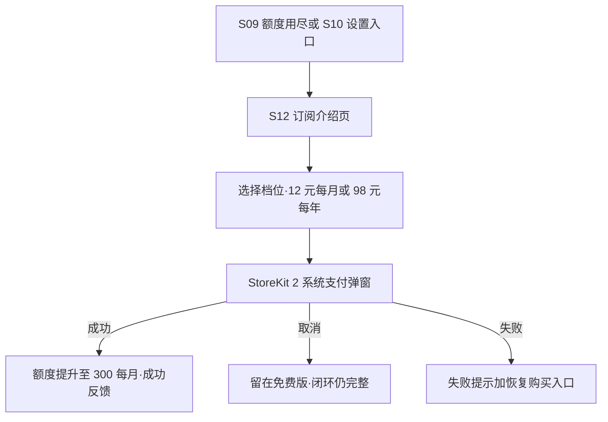

# 冰箱食材管家 UX 流程与信息架构

| 版本 | 日期 | 状态 | 作者 |
|---|---|---|---|
| v0.1 | 2026-08-17 | 已确认(2026-08-17 门禁) | 用户体验设计师(阶段 5a) |

## 📌 文档头契约(下游先读这节)

- **关键结论**(≤5 条):
  1. **界面清单共 12 屏:S01–S12;P0 ×9(S02–S10)+ P1 ×3(S01/S11/S12);P2 无独立屏**(FR-14 筛选器以 S07 内组件呈现,依据 D-016 的 1 人日组件级体量)。
  2. **导航模式:底部 TabBar + 中央凸起拍照按钮**——首发 4 位(库存 / 今天吃啥 / 中央 📷 / 设置),P1 速览上线后插入第 3 位成 5 位;中央常驻入口兑现 D-006「整拍录入最优先」。
  3. **闭环全覆盖**:「采购回家录入 → 日常查看 → 临期处理 → 做菜消耗」四环均有流程(F1–F3),异常路径 5 类齐备(识别失败 / 无网络 / 额度用尽 N=30 / 权限拒绝 / 空态)。
  4. **依据 D-015 无账号**:无注册 / 登录屏,首启落地 = Onboarding(P1)或库存首页;iCloud 备份为设置页开关,不设独立流程。
  5. P0 首发 9 屏即可跑通完整免费闭环;S12 订阅页为 P1(D-013:上线后 1 月内),额度护栏 S09 在订阅上线前隐藏订阅引导、保留手动录入主出路。
- **关键假设与置信度**:A-028(TabBar 结构,中)、A-029(推送落地复用 S02 临期筛选态,中)、A-030(FR-14 不设独立屏,高)、A-031(Onboarding 三屏合 1 文件,高)、A-032(字号定档,中)——供主代理登记假设账本。
- **可引用承诺**:界面清单 S01–S12(文件名 kebab-case 与 `app-ui-design` 原型文件一一对应)、TabBar 结构、字号层级(28/20/16/15/12px)可直接被 UI 设计师(阶段 5b)、阶段 6(AI 开发计划,界面数 12/P0 9 影响开发量)引用。
- **未决问题**:4 题(TabBar 形态 / S09 形态 / 原型范围 / 推送落地页),**按并行问题合并协议仅随回传提交,由主代理合并落盘 `questions-stage5.md`**。

## 1. 用户画像(Persona)

| 编号 | 身份 | 场景 | 核心诉求 | 技术熟练度 |
|---|---|---|---|---|
| P1 陈慧,32 岁,双职工家庭买菜主力(**主 Persona**) | 周末大采购 1 次(20–30 种食材塞满冰箱)+ 工作日零散补货;早出晚归,晚饭前 5 分钟定菜 | 录入别超过 10 秒;一眼看到什么快过期;临期食材被吃掉而不是扔掉 | 熟练(iPhone 重度) |
| P2 赵磊,26 岁,独居精打细算青年 | 2–3 天买一次少量菜;对价格与免费额度敏感,愿为省钱改变习惯 | 免费够用;少量食材也知道先吃啥;省钱看得见 | 熟练 |

## 2. 用户旅程图

> P1 旅程 = 产品主闭环「采购回家录入 → 日常查看 → 临期处理 → 做菜消耗」(对应 FR-01/02 → 05 → 07 → 08/09)。

| Persona | 目标 | 触点 | 动作 | 情绪 | 痛点 | 机会点 |
|---|---|---|---|---|---|---|
| P1 | 采购回家 10 秒录入 | 周六厨房台面;App 中央 📷 | 整拍一张 → 逐项核对 → 一键入库 | 忙乱 → 轻松(若快) | 逐条手输 20 分钟,竞品录入负担重(D-004) | 整拍 + 默认保质期带入,≤10 秒红线(FR-01/02) |
| P1 | 日常一眼看清库存 | 工作日早晚开 App(首页) | 浏览临期置顶列表 / 分类筛选 / 搜索 | 匆忙 | 列表长、重点不突出 | 临期红色置顶 + 剩余天数徽章(FR-05) |
| P1 | 临期食材不被遗忘 | 09:00 本地推送(免联网) | 点通知 → 直达临期清单 | 提醒到 = 安心 | 提醒了但不知怎么处理 | 落地临期清单 + 一跳「今天吃啥」消化临期(FR-07/08) |
| P1 | 晚饭 5 分钟定菜、吃掉临期 | 晚饭前「今天吃啥」Tab | 看推荐 → 选谱 → 做菜 → 一键核销用料 | 有成就感(吃掉 = 省钱) | 做完忘改库存,数据漂移失真 | 「做了这道菜」自动扣减,库存永真(FR-08/09) |
| P1 | 下次采购不重复买 | 采购途中,店内速览(P1) | 一屏看分类计数与临期项 | 淡定 | 想不起家里还有啥 | 分类计数一屏 + 临期分类置顶(FR-12) |
| P2 | 少量食材零成本管理 | 2–3 天一次补货后 | 整拍或手动录入 → 靠临期提醒决定先吃啥 | 精打细算 | 怕工具收费 | 免费闭环完整 + 30 次/月额度(FR-10,D-003/D-021) |
| P2 | 免费额度用得明白 | 拍照页额度徽章;额度用尽弹层 | 关注剩余次数;用尽时走手动录入 | 敏感但不焦虑 | 突然拦截 = 差评源 | 额度徽章前置透明 + 手动通道无限免费(S04/S09) |

## 3. 信息架构(页面树 ≤3 层)

```text
App(无注册登录 · D-015)
├── Onboarding 首启引导 S01(P1 · 一次性,TabBar 之外)
├── Tab1 库存 S02(默认落地)
│   ├── 食材详情 / 编辑 S03
│   ├── 手动录入 S06(识别失败 / 兜底通道)
│   └── 速览入口(P1 · 与 Tab3 同一屏 S11)
├── Tab2 今天吃啥 S07
│   └── 菜谱详情 S08
├── 中央 📷 拍一张 S04
│   ├── 识别结果确认 S05
│   │   └── 补录遗漏 → S06
│   └── 额度用尽引导 S09
├── Tab3 速览 S11(P1 · 上线后插入)
└── Tab4 设置 S10
    └── 订阅介绍 S12(P1 · D-013)
```

**导航模式结论:底部 TabBar + 中央凸起拍照按钮(共 5 位,首发 4 位)**。

| 槽位 | 名称 | 承载屏 | 上线时点 | 依据 |
|---|---|---|---|---|
| Tab1 | 库存 | S02(→S03/S06) | 首发 P0 | FR-05 默认落地;查看是最高频动作 |
| Tab2 | 今天吃啥 | S07(→S08) | 首发 P0 | FR-08 闭环第二支柱 |
| 中央 | 📷 拍一张 | S04(→S05/S09) | 首发 P0 | FR-01;D-006 整拍录入最高优先,入口常驻且视觉最重 |
| Tab3 | 速览 | S11 | P1(上线后快速迭代,时点未定;先于/同期/晚于 D-013 均可) | FR-12;上线前此位由 Tab4 前移占位,首发实际 4 位 |
| Tab4 | 设置 | S10(→S12) | 首发 P0 | 子任务 6.3;FR-07 提醒时点 / iCloud 备份 |

## 4. 关键任务流程(mermaid,含正常 + 异常路径)

### F0 注册登录说明(设计裁剪)

**无注册登录流程**——依据 D-015(无账号纯本地 + iCloud 备份):首次启动直接进 Onboarding(P1,首发前直接落库存首页 S02 空态引导);设置页提供 iCloud 备份开关。

### F1 整拍录入(核心闭环第 1 环,覆盖识别失败 / 无网络 / 额度用尽 N=30 / 权限拒绝)



### F2 临期处理 + 做菜闭环(第 3–4 环,覆盖通知被拒 / 缺料边界)



### F3 主闭环总览(旅程级,四环循环)



### F4 订阅 IAP(P1 · D-013 上线后 1 月内;首发不出现)



## 5. 界面清单(核心交付)

> 文件名 kebab-case,与 `app-ui-design` 原型文件一一对应;「组件规格态」= 空态 / 异常态等次要状态,原型以标注区块并列呈现(不另立文件)。

| 屏号 | 文件名 | 界面名称 | 目的 | 关键元素(主态) | 组件规格态 | 导航/图标建议 | 需求 ID | 优先级 |
|---|---|---|---|---|---|---|---|---|
| S01 | onboarding.html | 首启引导(3 屏分页合 1 文件) | 传达三支柱价值,申请通知权限,直达拍照 | 3 页分页(插画+28px 标题+15px 副文案)、进度圆点、第 3 页「开启提醒」预置弹窗、CTA「立即拍一张」 | 通知权限被拒(不阻塞,提示可去设置)、跳过按钮 | 无 TabBar(引导期);bell / camera | FR-13 | P1 |
| S02 | inventory-home.html | 库存首页(默认落地) | 一眼看到什么快过期,管理库存 | 临期项红色置顶 + 剩余保质期升序列表(食材名 16px / 数量单位 / 剩余天数徽章)、分类筛选 chips、搜索框、过期项「一键清理」 | 空库存(引导去拍照)、搜索无结果、临期筛选落地态(推送点击)、通知被拒临期横幅 | Tab1;refrigerator;行尾 chevron | FR-05、FR-06(清理)、FR-07(横幅兜底) | P0 |
| S03 | item-detail.html | 食材详情 / 编辑 | 修正数量保质期、标记已用、删除 | 食材图 + 名称分类、数量步进器(单位切换)、保质期选择器(默认值来自食材库)、备注、「标记已用 / 保存」按钮组 | 删除二次确认弹窗、消耗成功反馈、过期态(红色警示 + 一键移出库存) | push 自 S02;minus/plus、calendar、trash | FR-06、FR-03(保质期可改) | P0 |
| S04 | camera-scan.html | 整拍拍照页 | 一张照片拍全食材,≤10 秒链路起点 | 全屏取景框(多食材取景引导)、大快门、相册导入、顶部剩余额度徽章(如 18/30)、闪光灯、识别中进度条(≤3 秒) | 相机权限被拒(引导设置 + 转手动)、无网络提示、额度用尽拦截弹层(→S09) | TabBar 中央凸起 camera;bolt、photo | FR-01、FR-10(拦截点) | P0 |
| S05 | recognition-confirm.html | 识别结果确认页 | 候选逐项核对一键入库(差异化 D-2B-1 主战场) | 候选卡片列表(名称 / Top-3 候选切换 / 数量步进 / 单位 / 默认保质期行内可改 / 删除)、照片缩略图对照、「添加遗漏食材」入口、底部主按钮「确认入库 N 项」 | 识别失败态(引导手动 S06)、空候选态、单项编辑高亮态 | push 自 S04;checkmark.circle、plus.circle、trash | FR-02、FR-03(默认带入)、FR-01(≤10 秒终点) | P0 |
| S06 | manual-add.html | 手动录入页(兜底) | 无照片 / 识别失败 / 额度用尽时 ≤30 秒录入任何食材 | 搜索框(即时检索 ≥500 种库内食材)、常见分类网格、选中后快捷设置(数量 / 单位 / 默认保质期带入)、自定义新建表单(名称+分类+保质期,保存后可复用) | 搜索无结果(引导自定义新建)、自定义保存成功提示 | push;magnifyingglass、plus、square.grid.2x2 | FR-04、FR-03 | P0 |
| S07 | recipe-today.html | 今天吃啥推荐列表 | 只推现存可做的菜,优先消化临期(D-2B-2) | 菜谱卡片流(封面 / 名称 / 时长 / 难度 /「可消化 N 项临期」徽章 / 用料匹配摘要)、消化临期降序、顶部现存食材摘要条、筛选栏(P2 组件) | 库存为空(引导先录入)、无可做菜谱(缺料提示+放宽建议)、筛选无结果(清除最低权重筛选)、高级菜谱锁定态(P1) | Tab2;fork.knife;filter(P2) | FR-08、FR-14(P2 组件) | P0 |
| S08 | recipe-detail.html | 菜谱详情 | 看用料库存匹配,一键核销完成闭环 | 封面图、用料清单(逐项「现存 ✓ / 缺料 ✗」+ 所需量)、步骤折叠列表、时长 / 难度 / 营养标签、底部主按钮「做了这道菜」 | 缺料提示(不足置 0 并提示)、核销成功反馈(Toast + 库存变化摘要)、扣减明细确认弹层 | push 自 S07;checkmark.seal、clock | FR-08、FR-09 | P0 |
| S09 | quota-limit.html | 额度用尽引导(半屏弹层呈现) | 拦截识别,引导免费手动出路,透出订阅 | 本月额度环 30/30、说明文案、主按钮「手动录入(免费无限)」、次按钮「了解订阅」、次月重置日期提示 | 订阅用户态(不出现,M=300)、订阅未上线期(隐藏订阅按钮,只留手动出路) | modal/push 自 S04;lock | FR-10、FR-11(引导) | P0 |
| S10 | settings.html | 设置页 | 提醒时点 / 备份 / 权限 / 订阅入口 | 分组列表:提醒时点选择(默认 09:00)+ 测试推送、iCloud 备份开关、通知权限状态、订阅状态(P1,免费版标注 30 次/月)、隐私政策、关于版本 | iCloud 未登录提示、备份失败提示 | Tab4;gearshape;bell、cloud、lock.shield、info | FR-07(时点)、非功能(iCloud)、FR-11(入口) | P0 |
| S11 | shopping-overview.html | 购物库存速览 | 采购途中一屏看清各类存量,不重复买 | 分类卡片网格(分类图标 / 现存计数 / 最短保质期)、含临期项分类红色角标置顶、顶部「临期 N 项」摘要 | 空库存、全部健康(无角标) | Tab3;eye | FR-12 | P1 |
| S12 | subscribe.html | 订阅介绍页 | 展示订阅价值并完成购买 | 免费版 vs 订阅权益对比表(30 vs 300 次/月 + 高级菜谱标签)、档位卡(¥12/月、¥98/年)、恢复购买、StoreKit 2 购买按钮、价格小字 | 购买成功(额度即时生效反馈)、失败 / 取消(留免费版)、已订阅管理续订态 | push 自 S09/S10;crown、arrow.clockwise | FR-11 | P1 |

### 5.1 需求覆盖映射(逐条对齐 FR-01~14,不凭空造屏)

| 需求 | 落位 | 说明 |
|---|---|---|
| FR-01 | S04(→S05) | 整拍链路起点,≤10 秒验收计时至 S05 确认 |
| FR-02 | S05 | 候选核对 + 一键入库 |
| FR-03 | **无独立屏(支撑能力)** | 体现为 S05 默认保质期带入、S06 库内检索、S03 可改;食材库是数据层(子任务 1.6) |
| FR-04 | S06 | 手动兜底,≤30 秒验收 |
| FR-05 | S02 | 临期排序 / 筛选 / 搜索 / 红色标识 |
| FR-06 | S03 + S02 | 编辑消耗删除在 S03;过期一键清理入口在 S02 |
| FR-07 | **无独立屏(系统能力)** | 本地推送(子任务 3.1/3.2)+ S02 临期筛选落地态 + S02 横幅兜底态 + S10 时点设置 |
| FR-08 | S07 + S08 | 推荐列表 + 详情 |
| FR-09 | S08 | 「做了这道菜」一键核销 |
| FR-10 | S04 拦截弹层 + S09 | N=30(D-021);拦截点在拍照前,手动通道不拦 |
| FR-11 | S12(P1)+ S10 入口 | D-013 上线后 1 月内 |
| FR-12 | S11(P1) | 速览 |
| FR-13 | S01(P1) | Onboarding 三屏 |
| FR-14 | S07 筛选组件(P2) | 不设独立屏(A-030) |

### 5.2 交互原则与可访问性(SKILL 步骤 6;字号一律 px,下游 HTML 等值使用)

- **三态反馈**:
  - 加载:识别上传显示进度动画 +「识别中…」(P95 ≤3 秒);列表首屏骨架屏;一切加载可取消。
  - 成功:入库 / 核销成功用 Toast(1.5 秒自动消失)+ 列表即时刷新,**不用打断式弹窗**。
  - 失败:内联错误 + 永远给两条出路(重试 / 降级手动录入);识别失败**绝不阻塞录入**(闭环红线,FR-04 兜底)。
- **手势 / 快捷操作**(刻意克制):列表项左滑快捷「标记已用 / 删除」;拍照页音量键 = 快门;其余一律 Tap 优先,不引入学习成本手势。
- **可访问性底线**:
  - 字号层级(px):页面大标题 28px bold;页面标题 20px semibold;卡片 / 食材名标题 16px medium;正文 15px regular;辅助 / 标签 / 徽章 / TabBar 标签 12px。**全局最小 12px,禁止更小**(A-032)。
  - 触控热区 ≥44×44px(Apple HIG);正文文字对比度 ≥4.5:1(WCAG AA),临期红色仅作状态色不作唯一信息载体(同时用「剩 N 天」文字徽章)。
  - 支持 Dynamic Type 放大至 120% 不破版;推送与应用内横幅双通道,覆盖听障 / 通知关闭用户。

## 6. 待决策问题

按「并行问题合并协议」不落盘,4 题随回传提交主代理,合并编号入 `questions-stage5.md`(TabBar 形态 / S09 弹层形态 / 原型范围 P0+P1 / FR-07 推送落地页)。
