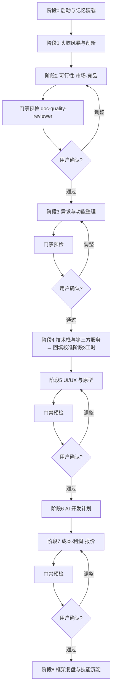

# workflow/ — 8 阶段执行指南 v1.1

> 主代理(项目经理)按本指南推进。每阶段固定节奏:**输入闸 → 执行 → 落盘登记 → 门禁预检(门禁阶段)→ 批量提问 → 用户确认后推进**。



## 通用规则(每阶段适用)

1. **输入闸(阶段开始前自检三问)**:① 上游文档存在且状态=已确认?② 项目画像未过期?③ 决策日志无未消解冲突?任一不满足 → 缺失项**显式记入产出文档「未决问题」节并指定回填阶段**,不得静默跳过;门禁阶段则直接拦截。
2. **输出闸(落盘前自检三查)**:① 模板/SKILL 结构字段齐备?② 数字均有计算过程与来源?③ 文档头契约已填?通过后才登记 `outputs-index.md`。
3. **门禁预检(🔒 阶段专属)**:批量提问**之前**,主代理用 skill `doc-quality-reviewer` 按本阶段「完成标准」逐条自检;不合格项**就地修复一轮**(上限 1 轮)后才向用户提问——用户看到的必须是过了自检的版本。
4. **断点续跑**:会话中断恢复时,读 `outputs-index.md` 的子任务状态,从 `pending` 子任务续跑,`done` 产物不重做。
5. **回滚**:用户否定某阶段结论时只重做该阶段;修订原因记入 `memory/decisions.md`。
6. **Token 台账**:每阶段结束在 `outputs-index.md` 登记(按 skill 粒度),含门禁三态(一次通过/经修订通过/回滚)。
7. **并行问题合并协议**:并行子代理的批量问题**不直接写共享的 questions-stageN.md**,只在回传中提交;由主代理统一合并编号落盘(避免互相覆盖)。
8. **完成标准唯一源**:门禁判定以本文件各阶段「完成标准」为准;各 SKILL 质量自检清单是其子集,两者冲突时以本文件为准。

---

## 阶段 0 · 启动与记忆装载(项目经理)
- **项目初始化(框架/项目分离)**:新项目先创建 `projects/<项目名>/` 骨架——运行 `scripts/init-project.sh <项目名>`(或手工:复制框架根 `memory/*.md` 模板到项目 `memory/`,建 `docs/01–08` 与 `UI/` 空目录);已有项目直接进入下一步。
- 读项目 `memory/` 三数据文件。**初始化语义**:三文件均为空模板 → 清除「示例行」原地启用;**任一非空 → 视为恢复**,进度以 `outputs-index.md` 为唯一事实源,与画像冲突时向用户确认。
- 新项目用**一轮**问题确认画像四要素(一句话概述/目标用户/核心价值/做不做边界)。
- 完成标准:`project-profile.md` 状态「已确认」,`outputs-index.md` 已建。

## 阶段 1 · 头脑风暴与创新(项目经理)
- 调用 `brainstorm-facilitator`;产出 `docs/01-brainstorm/ideas.md`(模板 `templates/brainstorm-ideas.md`)。
- **快速竞品存在性预检(必做)**:发散前用 1–2 次检索确认「是否已存在高度同类产品」——只判存在性不做分析;发现强同类即在 ideas.md 标注风险并写入推荐理由(详细分析仍在阶段 2),避免关键情报迟到一个阶段。
- 完成标准:≥12 条创意、3–5 方向含打分、推荐方向+放弃理由、待议池已建、竞品存在性结论已标注。
- 问题收集:方向取舍、人群、商业模式;落盘 `questions-stage1.md`。

## 阶段 2 · 可行性·市场·竞品(市场分析师)🔒
- 调用 `market-supply-demand` 与 `competitor-analysis`(**并行**,两份独立报告)。
- 产出:`docs/02-market/feasibility.md`、`docs/02-market/competitor-analysis.md`。
- 完成标准:可行性结论(做/调整后做/不做)+ 置信度;竞品 ≥3;数字有来源。
- 门禁:预检 → 批量提问(可行性若「调整后做」,调整方向必须经用户确认)。

## 阶段 3 · 需求与功能整理(项目经理 + 全栈工程师)🔒
- 调用 `requirements-organizer` → `feature-breakdown`(串行)。阶段 2 缺失时按输入闸记欠账。
- 产出:`docs/03-requirements/requirement-doc.md`、`feature-list.md`(**工时此时为初估值,阶段 4 定稿技术栈后回填校准**)。
- 完成标准:需求含验收标准与范围边界;功能清单含缓冲后总人日(注明「初估,待阶段 4 校准」)。
- 门禁:预检 → 批量提问(P0 范围、不做清单、含糊需求裁决)。

## 阶段 4 · 技术栈与第三方服务(架构师)
- 调用 `tech-stack-selector` 与 `third-party-service-scout`(可并行)。
- 产出:`docs/04-tech/tech-stack.md`、`third-party-services.md`。
- **回填循环(必做)**:技术栈定稿后,由**高级全栈工程师**按选型回填校准 `feature-list.md` 工时(变更写入该文档「版本/变更记录」),重大偏差(>±20%)列入下一轮批量提问。
- 完成标准:推荐方案含打分对比与架构图;第三方成本两档;功能清单已回填校准。

## 阶段 5 · UI/UX 与原型(UX 设计师 + UI 设计师)🔒
- 调用 `ux-flow-designer` → `app-ui-design`(串行:原型依赖界面清单)。
- 产出:`docs/05-uiux/ux-flows.md`、`ui-spec.md`、`./UI/` 静态原型站。
- 完成标准:界面清单与功能对齐;原型通过 `app-ui-design` 自检清单(含 CDN 可达性校验)。
- 门禁:预检 → 用户浏览 `./UI/index.html` 确认风格与界面范围。

## 阶段 6 · AI 开发计划(AI 开发高级工程师)
- 调用 `ai-dev-estimator`;以**回填校准后**的功能清单工时为基准。
- 产出:`docs/06-ai-plan/ai-dev-plan.md`。完成标准:任务包+周期+token 三档+人机分工。

## 阶段 7 · 成本·利润·报价(商务顾问)🔒
- 调用 `quotation-calculator`。产出:`docs/07-business/cost-profit.md`、`quotation.md`。
- 完成标准:成本逐项可追溯;利润三档;报价单可直接发甲方(无内部数字泄露)。
- 门禁:预检 → 批量提问(利润档位、报价口径、付款里程碑)。

## 阶段 8 · 框架复盘(提示词优化员)
- 调用 `doc-quality-reviewer` 做全流程终审 → `docs/08-retro/framework-retro.md`。
- **数据驱动进化**:按 `outputs-index.md` 台账排序,优先修订「回滚率最高/修订要点最多」的 SKILL;对可客观验证的技能(app-ui-design、feature-breakdown、quotation-calculator)用本次真实运行做回归对照。
- 把一次性优秀提示词标准化为新 SKILL.md 入库;更新 `AGENTS.md` 注册表。

## 产出目录规范(路径相对**项目目录** `projects/<项目名>/`)

```text
仓库根/
├── AGENTS.md  roles/  skills/  templates/  workflow/  scripts/  memory/(模板)
└── projects/<项目名>/
    ├── docs/   # 01-brainstorm / 02-market / 03-requirements / 04-tech /
    │          # 05-uiux / 06-ai-plan / 07-business / 08-retro
    ├── memory/ # 该项目专属记忆
    └── UI/     # app-ui-design 生成的静态原型
```
